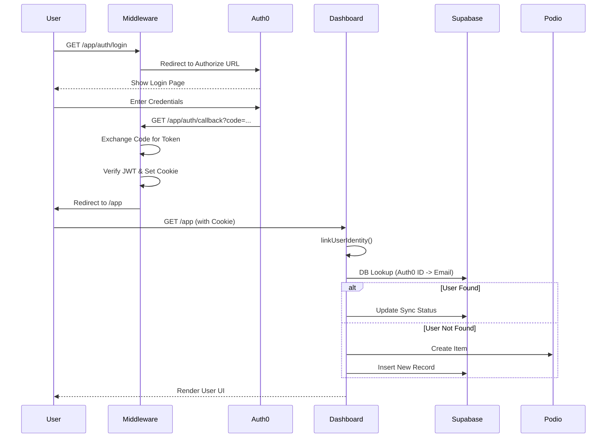

# Authentication Flow Guide

This application uses a custom **Middleware-based Authentication** system designed to run on the Edge (Cloudflare Workers/Webflow Cloud). It avoids standard Next.js Auth libraries that often rely on Node.js runtimes.

## 1. High-Level Architecture

Instead of using standard Next.js Route Handlers (`src/app/api/...`), all authentication routes are intercepted and handled directly by `middleware.ts`. This ensures extremely fast redirects and compatibility with non-Node environments.

### Key Components

| Component | Path | Purpose |
| :--- | :--- | :--- |
| **The Router** | `src/middleware.ts` | Intercepts requests to `/auth/*` and executes auth logic. |
| **The Logic** | `src/lib/auth-edge.ts` | Contains the implementation of OIDC (OpenID Connect), JWT verification, and cookie management using standard Web APIs. |
| **The Sync** | `src/app/(dashboard)/page.tsx` | Links the authenticated Auth0 user with Podio/Supabase data on their first visit. |

## 2. Detailed Flow

### Step 1: Login Request
1.  **User Action**: User visits `/app/auth/login` (or is redirected there).
2.  **Middleware**: Detects path ending in `/auth/login`.
3.  **Action**: Calls `login()` from `auth-edge.ts`.
    - Generates a random `state` and `nonce`.
    - Stores `state` in a secure `auth_state` cookie.
    - Redirects user to **Auth0 Universal Login**.

### Step 2: Authentication (Auth0)
1.  **Auth0**: User enters credentials.
2.  **Success**: Auth0 redirects back to `/app/auth/callback` with a `code` and `state`.

### Step 3: Callback Processing
1.  **Middleware**: Detects path ending in `/auth/callback`.
2.  **Action**: Calls `callback()` from `auth-edge.ts`.
    - Verifies the `state` parameter matches the `auth_state` cookie (CSRF protection).
    - Exchanges the `code` for an **ID Token** and **Access Token** via direct `fetch` to Auth0.
    - Verifies the ID Token signature using `jose` (Edge-compatible JWT library).
    - Sets an encrypted, signed `app_session` cookie containing the user profile.
    - Redirects to the dashboard (`/app`).

### Step 4: Session & Identity Linking
1.  **Dashboard Load**: User arrives at `/app`.
2.  **Middleware**: Checks for valid `app_session`. Allows request to proceed.
3.  **Page Load (`page.tsx`)**:
    - Decrypts the session token.
    - **Identity Logic**: Calls `linkUserIdentity()` to sync the Auth0 user with the internal system (Podio/Supabase).
    - Determines user type (VIP vs Standard) and renders the appropriate UI.

## 3. Visual Diagram

## 5. Identity Linking Logic (`linkUserIdentity`)

This process ensures that every authenticated Auth0 user has a corresponding record in **Supabase** and **Podio**. It runs on the server side in `page.tsx` immediately after session verification.

### Logic Flow (Per User Type)

The system distinguishes between **Portal Users** (Business/Customers) and **Students** based on the login type.

#### A. Portal Users (Customers)
1.  **Lookup by Auth0 ID**: Checks `customers` table for a match on `auth0id`.
2.  **Fallback Lookup by Email**: If no ID match, checks for `email`.
    - *If found via email*: Updates the record with the new `auth0id` and sets status to `synced`.
3.  **Create New User** (if not found):
    - **Podio**: Creates a new item in the **Customers App**.
    - **Supabase**: Inserts a new row in `customers` table with the `podio_item_id`.

#### B. Student Users
1.  **Lookup by Auth0 ID**: Checks `students` table for a match on `auth0id`.
2.  **Fallback Lookup by Email**: If no ID match, checks for `email`.
    - *If found via email*: Updates the record with the new `auth0id` and sets status to `synced`.
3.  **Create New User** (if not found):
    - **Podio**: Creates a new item in the **Students App**.
    - **Supabase**: Inserts a new row in `students` table with the `podio_item_id`.

## 4. Troubleshooting
- **Loops**: If `middleware.ts` is configured to protect `/api/` routes but the app tries to fetch from them without a session, it can cause redirect loops.
- **Edge Runtime**: This system relies on `jose` and `fetch`. Using Node.js-specific modules (like `fs` or `crypto` without `subtle` prefix) in `auth-edge.ts` will break the build.
